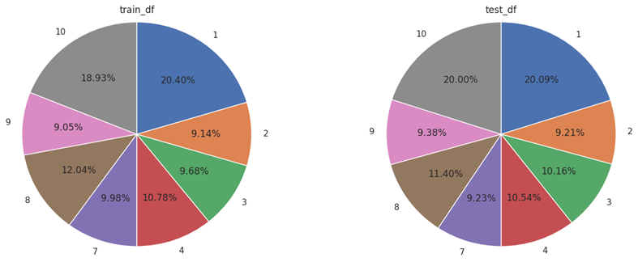
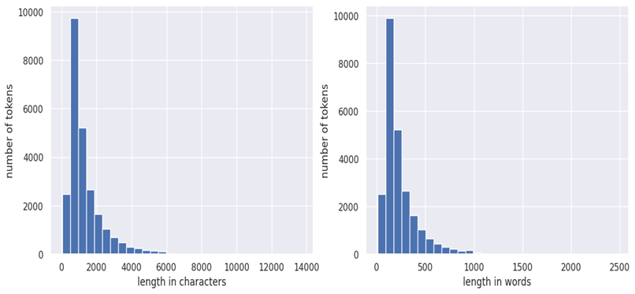

 # Movie reviews classification app
Stages of work on this project

1) To begin with, I’ve conducted a basic EDA, finding insights about labels distribution and length of reviews  
Number of reviews with different rating scores:
  
 Length of reviews: 
  
2) I’ve implemented several models:
    * Logistic regression with feature extraction via bag-of-words vectorization
    * Fasttext model
    * XLnet fine-tuning  

    The task was split into two parts: rating prediction and sentiment prediction. 
I’ve experimented with the model, which predicts rating and performs binary classification (positive/negative) based on the rating, 
and it showed lower accuracy at sentiment prediction. 
However, it should be noted, that the first approach has certain disadvantages too: 
we need to train 2 models instead of 1, it’s not obvious how to handle the cases, when, for instance, 
predicted rating is 10, but predicted sentiment is negative.
Due to expensiveness of deep learning models training, 
XLnet model was fine-tuned on rating prediction only, and predicted rating was used in sentiment classification. 
Rating prediction and sentiment prediction were both formulated as classification tasks.  

    Out of all models based on bag-of words approach, 
the best result at sentiment prediction was achieved by TF-IDF vectorization, 
and at rating prediction by hashing vectorization.  

    I’ve also trained Fasttext model, performing classification with the use of word embeddings, 
but this model was unable to beat results of the logistic regression on bag-of-words.  

    From the variety of deep learning models, I’ve picked XLnet model, based on Transformers architecture,
as it gained best results in several text classification benchmarks.
Fine-tuned version of this model showed the best result in this task,
but its deployment turned out to be too challenging and for the moment was abandoned.
However, the model is already available on [Hugging Face Hub](https://huggingface.co/pa-shk/movie-review-classifier).   
    
    | Model                                                         | Accuracy (rating prediction) | Accuracy (sentiment prediction) |
    |---------------------------------------------------------------|------------------------------|---------------------------------|
    | CountVectorizer + LogisticRegression                          | 0.399	                       | 0.856                           |
    | TfidfVectorizer + LogisticRegression                          | 0.428                        | 	0.883                          |
    | TfidfVectorizer + LogisticRegression (hyperparameters tuning) | 0.456                        | 0.895                           |
    | HashVectorizer + LogisticRegression (hyperparameters tuning)  | 0.431	                       | 0.868                           |
    | Fasttext                                                      | 0.345                        | 0.853                           |
    | XLnet                                                         | 0.517                        | 0.945                           |
     
3) As a final model for deployment, the pipeline consisting of HashingVectorizer and LogisticRegression was chosen
for rating prediction as well as for sentiment prediction. 
The main reason is, hashing vectorization is much more memory efficient as it does not require storing the vocabulary. 
The pipeline was deployed on a [free server](https://moviereviewclassifier-pvlshknv.b4a.run).
